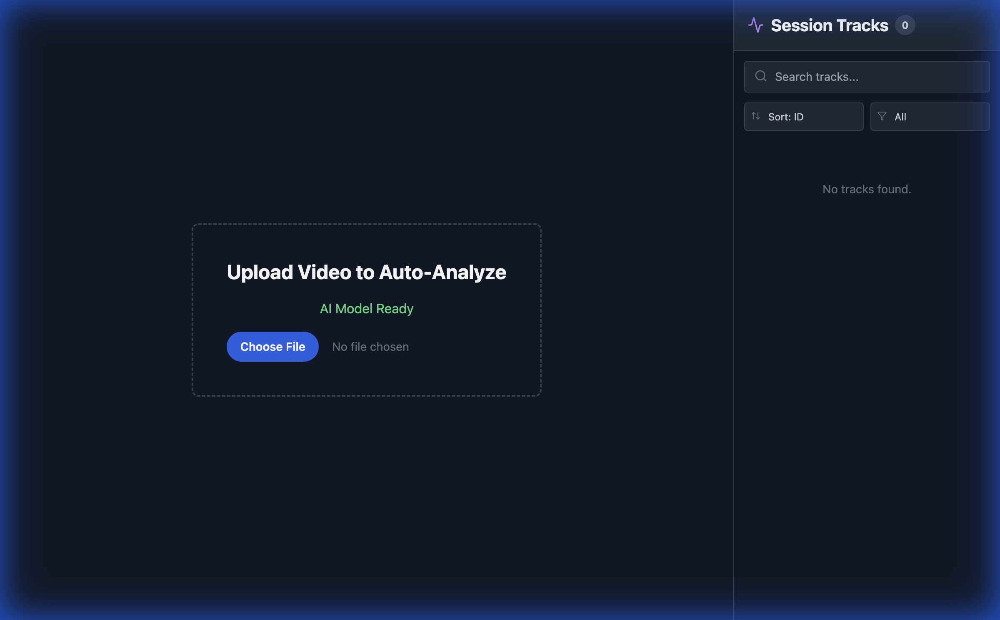

# MP4 Video Analysis Tool (AI-Powered)

**"A Computer Vision Suite for Autonomous Driving R&D"**



This is an advanced, web-based tool designed to emulate the **computer vision systems used in autonomous vehicles**. Born from experience directly within the **self-driving car** industry, this tool brings industrial-grade object detection, classification, and tracking algorithms directly into the browser.

It allows researchers and developers to visualize how an **AI driver** sees the world—detecting pedestrians, analyzing traffic lights, and tracking vehicles in real-time.

## 🚘 Autonomous Vehicle Features

### 👁️ "Robot Vision" (Smart AI Detection)
*   **Dual-Model Architecture**: Combines **COCO-SSD** for fast object localization and **MobileNet** for detailed classification, mimicking the sensor fusion of self-driving cars.
*   **Strict Schema Enforcement**: Adheres to a strict ontology common in AV datasets: `Vehicle`, `Pedestrian`, `Bus`, `Truck`, `Cyclist`, `Emergency-Vehicle`, `Golf-Cart`, `Van`, `Scooter`, and `Animal`.
*   **Traffic Light Recognition**: Uses computer vision to distinguish between **Red** (Stop) and **Green** (Go) states, a critical function for Level 4/5 autonomy.

### 🎥 Industrial-Grade Analysis Tools
*   **Terminator HUD**: A high-tech "Head-Up Display" overlay visualizes the LiDAR-like scanning process.
*   **Analysis Cropping**: Precisely analyze specific scenarios (e.g., "left turn at intersection") by cropping the analysis timeline.
*   **Pause & Resume**: Fully controllable analysis loop, allowing for frame-by-frame inspection of corner cases.

### 📊 "Session Tracks" (Object Tracking)
*   **Object Persistence**: Just like a self-driving car tracks an obstacle over time, this tool maintains a unique ID for every object (`Track ID #42`) even as it moves across the frame.
*   **Probability Scores**: Displays the AI's confidence levels (`98%`), crucial for safety-critical decision making.
*   **Click-to-Seek**: Instantly jump to the moment an object was first detected—useful for reviewing "edge cases" or false positives.

### 💾 Memory & Simulation (YAML)
*   **Save Scenarios**: Export your entire analysis session as a readable **YAML** file (`.yaml`). Standard format for AV simulation scenarios.
*   **Teach Mode**: Manually correct the AI (e.g., "Vehicle #3 is actually a Police Car"). This "human-in-the-loop" feedback is essential for training better autonomous systems.

## 🛠️ Technology Stack
*   **Frontend**: React (Vite)
*   **AI/ML**: TensorFlow.js, COCO-SSD, MobileNet
*   **Styling**: Tailwind CSS
*   **Data Format**: YAML (js-yaml)

## 📦 Installation & Usage

1.  **Clone the repository**:
    ```bash
    git clone https://github.com/FuwadT/MP4-Vido-Analysis-Tool.git
    cd MP4-Vido-Analysis-Tool
    ```

2.  **Install dependencies**:
    ```bash
    npm install
    ```

3.  **Run the development server**:
    ```bash
    npm run dev
    ```

4.  **Open in Browser**:
    Navigate to `http://localhost:5173`.

## 📝 License
This project is open-source.
